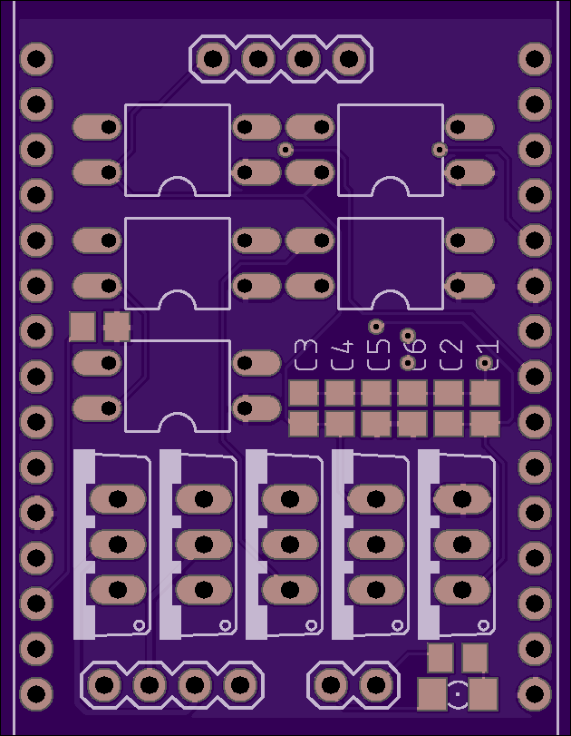
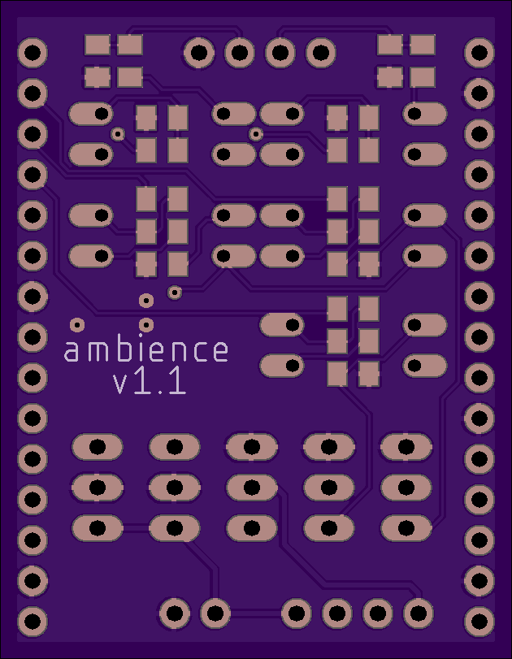

# Ambience hardware

## The project

Project page: [Ambience](https://jeajjr.github.io/ambience/)

## Hardware project

This repository contains the Eagle schematic and board layout of the project.

Software used: Autodesk Eagle 9

The hardware project uses an ESP8266 along with power control circuits to control:
* a 12V RGB LED bar
* two 5V digital outputs, intened to control an Arduino relay board.

## Layout

